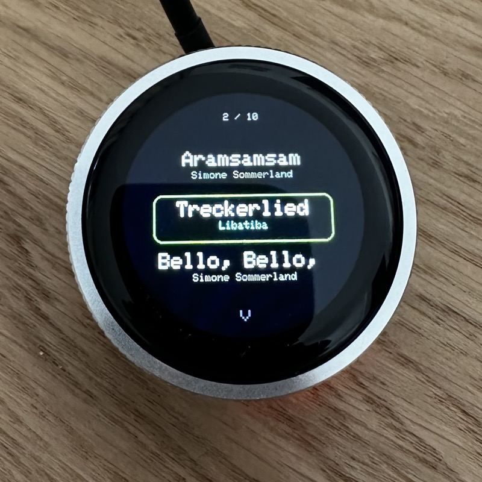
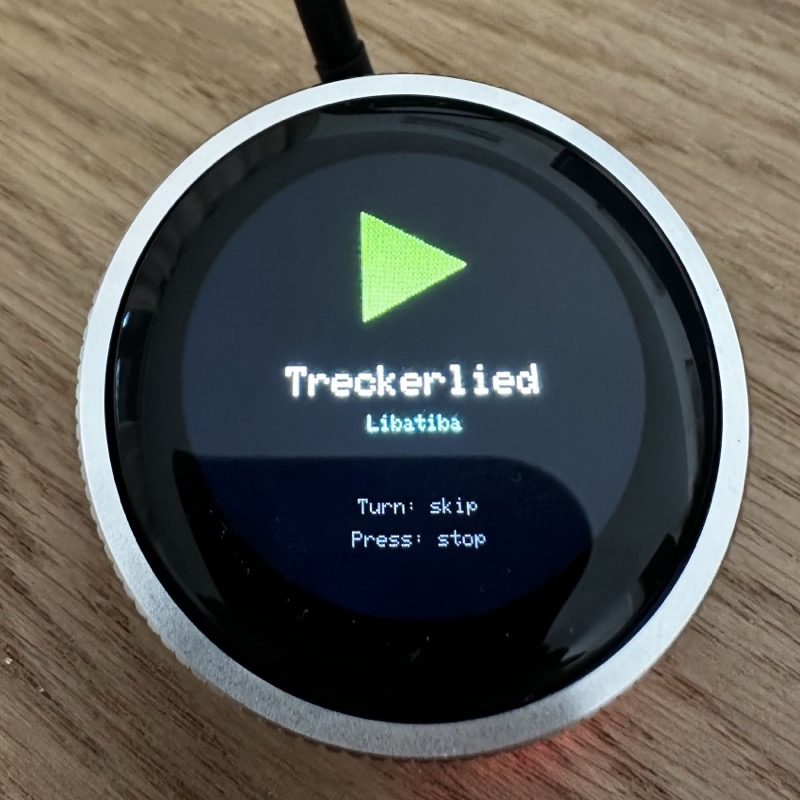

# Spotipanel - Physical Spotify Playlist Launcher

A toddler-friendly physical Spotify player built on the Elecrow CrowPanel 1.28" HMI ESP32-S3 Rotary Display. Browse and play songs from a Spotify playlist using a rotary knob.

| Track List | Now Playing |
|:---:|:---:|
|  |  |

## How It Works

1. **Power on** — connects to WiFi and loads your playlist
2. **Turn the knob** — scroll through songs (3 visible at a time)
3. **Press the knob** — play the selected song on your speaker
4. **While playing** — turn to skip tracks, press to pause and return to list

Playback targets a Spotify Connect speaker on the same network.

## Hardware

- **Elecrow CrowPanel 1.28" HMI ESP32-S3 Rotary Display** ([GitHub](https://github.com/Elecrow-RD/CrowPanel-1.28inch-HMI-ESP32-Rotary-Display-240-240-IPS-Round-Touch-Knob-Screen))
- 240x240 circular IPS display (GC9A01)
- Rotary encoder with press switch
- ESP32-S3, WiFi, 8MB PSRAM, 16MB Flash

## Setup

### 1. Clone and install

```bash
git clone https://github.com/githendrik/spotipanel.git
cd spotipanel
pip install platformio  # if not installed
```

### 2. Configure credentials

Copy the example files and fill in your details:

```bash
cp src/credentials.h.example src/credentials.h
cp secrets.json.example secrets.json
```

Edit `src/credentials.h` with your WiFi and Spotify credentials.

### 3. Generate a Spotify refresh token

```bash
node tools/get_token.js
```

This opens a browser for Spotify authorization. Paste the resulting refresh token into `src/credentials.h`.

**Note**: Add `http://127.0.0.1:8888/callback` as a redirect URI in your [Spotify app settings](https://developer.spotify.com/dashboard).

### 4. Build and upload

```bash
pio run -t upload --upload-port /dev/cu.usbmodem11101
```

### 5. Configure playlist and speaker

In `src/main.cpp`, set:
- `PLAYLIST_ID` — your Spotify playlist ID
- `TARGET_SPEAKER` — name of your Spotify Connect speaker

## Project Structure

```
spotipanel/
├── src/
│   ├── main.cpp              # All application logic
│   ├── credentials.h          # WiFi + Spotify secrets (gitignored)
│   └── credentials.h.example  # Template
├── tools/
│   └── get_token.js           # Spotify OAuth token generator
├── secrets.json               # Secrets for tools (gitignored)
├── secrets.json.example       # Template
├── platformio.ini             # PlatformIO config
└── AGENTS.md                  # AI agent context
```

## Tech Stack

- **PlatformIO** with Arduino framework
- **LovyanGFX** for display (GC9A01 controller)
- **ArduinoJson v7** for Spotify API responses
- **Spotify Web API** with OAuth 2.0 refresh token flow

## Known Limitations

- Speaker must be powered on manually before playback starts
- Serial monitor doesn't work (ESP32-S3 USB CDC issue) — debug via on-screen text
- Playlist limited to 20 tracks (memory constraint)

## License

MIT

## Acknowledgments

- [Elecrow](https://github.com/Elecrow-RD/CrowPanel-1.28inch-HMI-ESP32-Rotary-Display-240-240-IPS-Round-Touch-Knob-Screen) for the hardware
- [LovyanGFX](https://github.com/lovyan03/LovyanGFX) for the display library
- [Spotify Web API](https://developer.spotify.com/documentation/web-api)
